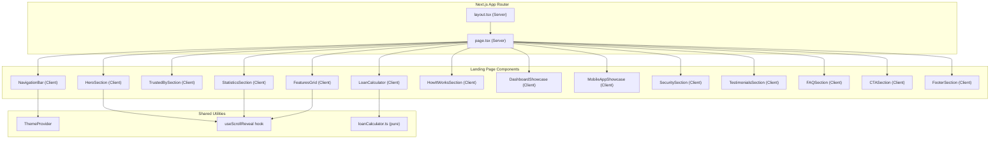

# Design Document: Landing Page Redesign

## Overview

This design transforms the existing Loaniyo DeFi wallet-connect page (`src/app/page.tsx`) into a premium fintech marketing landing page. The new page consists of 14 content sections plus cross-cutting concerns (responsive design, theming, animations, accessibility, SEO). The architecture leverages Next.js App Router with server-side rendering for SEO-critical content and client-side hydration for interactive elements — achieving fast initial loads while supporting rich animations and interactivity.

**Key Design Decisions:**
- **Component-per-section architecture**: Each of the 14 sections becomes an independent React component under `src/components/landing/`, enabling isolated development, testing, and lazy-loading.
- **Server Component shell + Client Component islands**: The page shell (`page.tsx`) is a Server Component that renders metadata, structured data, and static HTML. Interactive sections (calculator, carousel, theme toggle) are Client Components with `'use client'` directives.
- **Framer Motion for all animations**: A single animation library avoids bundle bloat from multiple animation approaches. `useReducedMotion` hook disables animations globally for accessibility.
- **CSS-first dark/light mode**: Tailwind's `darkMode: 'class'` strategy with a `ThemeProvider` that reads localStorage → OS preference → light fallback, injecting the class on `<html>` before paint via an inline script in `layout.tsx`.

## Architecture



**Rendering Strategy:**
- `layout.tsx` — Server Component. Injects theme-detection inline script, loads fonts, sets metadata.
- `page.tsx` — Server Component shell. Imports all section components. Below-the-fold sections wrapped in `dynamic(() => import(...), { ssr: true })` or React `lazy` with Suspense for code-splitting.
- Section components — Client Components (`'use client'`). Each handles its own animations and interactivity.

**Performance Strategy:**
- Code-split each section into separate chunks (~5–15KB each).
- Lazy-load images with `next/image` using `loading="lazy"` and `priority` on hero image only.
- Use `will-change: transform` sparingly (only on actively animating elements).
- Preload fonts via `next/font` to avoid FOIT/FOUT.
- Inline critical CSS via Tailwind's JIT compiler.

## Components and Interfaces

### File Structure

```
src/
├── app/
│   ├── layout.tsx              # Root layout (Server) — fonts, metadata, theme script
│   ├── page.tsx                # Landing page shell (Server) — imports sections
│   └── globals.css             # Tailwind directives, theme variables, custom utilities
├── components/
│   └── landing/
│       ├── NavigationBar.tsx
│       ├── HeroSection.tsx
│       ├── TrustedBySection.tsx
│       ├── StatisticsSection.tsx
│       ├── FeaturesGrid.tsx
│       ├── LoanCalculator.tsx
│       ├── HowItWorksSection.tsx
│       ├── DashboardShowcase.tsx
│       ├── MobileAppShowcase.tsx
│       ├── SecuritySection.tsx
│       ├── TestimonialsSection.tsx
│       ├── FAQSection.tsx
│       ├── CTASection.tsx
│       ├── FooterSection.tsx
│       └── shared/
│           ├── ThemeToggle.tsx
│           ├── ScrollReveal.tsx
│           ├── AnimatedCounter.tsx
│           └── SectionWrapper.tsx
├── hooks/
│   ├── useTheme.ts
│   ├── useScrollReveal.ts
│   └── useReducedMotion.ts
├── lib/
│   ├── loanCalculator.ts      # Pure calculation functions
│   ├── theme.ts               # Theme constants and utilities
│   └── constants.ts           # Section data, testimonials, FAQs, features
└── providers/
    └── ThemeProvider.tsx
```

### Key Component Interfaces

```typescript
// ThemeProvider
interface ThemeContextValue {
  theme: 'light' | 'dark';
  toggleTheme: () => void;
  systemPreference: 'light' | 'dark';
}

// NavigationBar
interface NavigationBarProps {
  // No props — reads theme from context, links from constants
}

// LoanCalculator pure function
interface LoanCalculation {
  monthlyPayment: number;
  totalRepayment: number;
  totalInterest: number;
  principal: number;
}

function calculateLoan(
  amount: number,       // 1,000 – 100,000
  annualRate: number,   // 1% – 30% (step 0.5%)
  months: number        // 6 – 60
): LoanCalculation;

// FAQ Section
interface FAQItem {
  question: string;
  answer: string;
}

// Testimonial
interface Testimonial {
  id: string;
  name: string;
  occupation: string;
  avatar: string;
  rating: number;  // 1–5
  text: string;
}

// ScrollReveal wrapper
interface ScrollRevealProps {
  children: React.ReactNode;
  threshold?: number;       // default 0.2
  delay?: number;           // stagger delay in ms
  once?: boolean;           // default true
  disabled?: boolean;       // for reduced motion
}

// AnimatedCounter
interface AnimatedCounterProps {
  target: number;
  duration?: number;        // ms, default 2000
  suffix?: string;          // e.g., "%", " min"
  prefix?: string;
  decimals?: number;
}
```

### Section Communication

Sections are independent — no props flow between them. Shared state:
- **Theme**: Via `ThemeProvider` context (accessible to all).
- **Scroll position**: Each section independently uses `useScrollReveal` (IntersectionObserver-based).
- **Navigation**: Smooth scrolling via `id` attributes on sections + `scrollIntoView({ behavior: 'smooth' })`.

## Data Models

### Static Data (in `src/lib/constants.ts`)

```typescript
// Navigation links
const NAV_LINKS = [
  { label: 'Home', href: '#hero' },
  { label: 'Features', href: '#features' },
  { label: 'How It Works', href: '#how-it-works' },
  { label: 'Security', href: '#security' },
  { label: 'Pricing', href: '#calculator' },
  { label: 'FAQ', href: '#faq' },
  { label: 'Contact', href: '#footer' },
] as const;

// Features
interface Feature {
  icon: string;          // Lucide icon name
  title: string;         // max 30 chars
  description: string;   // max 80 chars
  variant: 'standard' | 'featured';
}

// Statistics
interface Statistic {
  value: number | string;
  suffix: string;
  label: string;
  isNumeric: boolean;
}

// Security measures
interface SecurityFeature {
  icon: string;
  title: string;
  shortDescription: string;   // 15–80 chars
  expandedDescription: string; // 40–200 chars
}

// How It Works steps
interface Step {
  number: number;
  title: string;
  description: string;  // max 120 chars
}

// Testimonials
interface Testimonial {
  id: string;
  name: string;
  occupation: string;
  avatar: string;
  rating: number;
  text: string;
}

// FAQ items
interface FAQItem {
  question: string;
  answer: string;
}
```

### Loan Calculator State

```typescript
interface CalculatorState {
  amount: number;       // 1,000 – 100,000
  rate: number;         // 1 – 30 (percentage, step 0.5)
  months: number;       // 6 – 60
}

interface CalculatorOutput {
  monthlyPayment: number;
  totalRepayment: number;
  totalInterest: number;
  principal: number;
}
```

### Theme Persistence

```typescript
// localStorage key: 'loaniyo-theme'
// Values: 'light' | 'dark'
// Fallback chain: localStorage → window.matchMedia('(prefers-color-scheme: dark)') → 'light'
```

### SEO Structured Data

```typescript
// JSON-LD Organization schema
interface OrganizationSchema {
  '@context': 'https://schema.org';
  '@type': 'Organization';
  name: 'Loaniyo';
  url: string;
  logo: string;
}

// JSON-LD FAQPage schema
interface FAQPageSchema {
  '@context': 'https://schema.org';
  '@type': 'FAQPage';
  mainEntity: Array<{
    '@type': 'Question';
    name: string;
    acceptedAnswer: {
      '@type': 'Answer';
      text: string;
    };
  }>;
}
```

## Correctness Properties

*A property is a characteristic or behavior that should hold true across all valid executions of a system — essentially, a formal statement about what the system should do. Properties serve as the bridge between human-readable specifications and machine-verifiable correctness guarantees.*

This feature is primarily UI rendering and layout, so most acceptance criteria are best tested with example-based tests. However, the loan calculator logic and theme resolution logic contain pure functions with meaningful input variation that benefit from property-based testing.

### Property 1: Loan calculation mathematical consistency

*For any* valid loan parameters (amount in [1000, 100000], annual rate in [1%, 30%], duration in [6, 60] months), the calculated monthly payment multiplied by the number of months SHALL equal the total repayment amount (within ±$0.01 rounding tolerance), and the total repayment SHALL always be greater than or equal to the principal amount.

**Validates: Requirements 6.3**

### Property 2: Currency formatting correctness

*For any* non-negative numeric value passed to the currency formatter, the output string SHALL contain exactly one currency symbol prefix and exactly two digits after the decimal point.

**Validates: Requirements 6.7**

### Property 3: No horizontal overflow at any viewport width

*For any* viewport width between 320px and 2560px (inclusive), the rendered landing page SHALL have a document scrollWidth less than or equal to the viewport clientWidth (i.e., no horizontal scrollbar appears).

**Validates: Requirements 15.1**

### Property 4: Theme resolution follows priority chain

*For any* combination of localStorage state (absent, 'light', 'dark') and OS color-scheme preference (light, dark), the resolved theme SHALL equal localStorage value when present, otherwise SHALL equal OS preference, otherwise SHALL default to 'light'.

**Validates: Requirements 16.1**

### Property 5: Theme toggle persistence round-trip

*For any* initial theme state and any sequence of toggle operations, after each toggle the value stored in localStorage SHALL always equal the currently active theme, and reading that value back SHALL resolve to the same theme.

**Validates: Requirements 16.5**

## Error Handling

### Theme System Errors

| Error Condition | Handling Strategy |
|---|---|
| localStorage unavailable (private browsing, quota exceeded) | Catch exception in ThemeProvider, continue with in-memory theme state. No persistence, no user-facing error. (Req 16.6) |
| localStorage contains invalid value (not 'light'/'dark') | Treat as absent — fall through to OS preference → light fallback. |
| `matchMedia` not supported | Assume light mode preference. |

### Loan Calculator Errors

| Error Condition | Handling Strategy |
|---|---|
| Input values outside valid range | Clamp to nearest valid boundary. Slider UI prevents out-of-range input, but `calculateLoan()` defensively clamps. |
| Division by zero (0% rate) | Use simple division formula (amount / months) when rate is 0, bypassing the standard amortization formula. |
| Floating-point precision | Round monetary outputs to 2 decimal places using `Math.round(value * 100) / 100`. |

### Newsletter Form Errors

| Error Condition | Handling Strategy |
|---|---|
| Invalid email format | Display inline error message below input. Prevent form submission. (Req 14.4) |
| Network failure on submission | Display "Something went wrong. Please try again." message. Allow retry. |
| Empty submission | Disable submit button until input is non-empty. |

### Animation Errors

| Error Condition | Handling Strategy |
|---|---|
| Framer Motion fails to load | Components render in final visual state without animation. Use conditional check on motion component availability. |
| IntersectionObserver not supported | Render all sections in final state immediately (no scroll-reveal). |
| `prefers-reduced-motion: reduce` | Disable all motion via `useReducedMotion()` hook — render elements at their final position/opacity. (Req 17.3) |

### Image/Asset Loading Errors

| Error Condition | Handling Strategy |
|---|---|
| Font fails to load | System sans-serif fallback stack activates automatically via `next/font` configuration. |
| Image fails to load | Use `next/image` `onError` to display placeholder or hide broken element with `aria-hidden`. |

## Testing Strategy

### Overview

This feature is primarily a UI rendering and layout project. The testing strategy uses:

1. **Example-based unit/component tests** — For the majority of acceptance criteria (content presence, layout behavior, interactions, accessibility).
2. **Property-based tests** — For the loan calculator logic, currency formatting, theme resolution, and responsive overflow behavior.
3. **Integration tests** — For full-page rendering, navigation flow, and end-to-end interaction sequences.
4. **Smoke tests** — For Lighthouse performance score and SSR metadata verification.

### Test Framework

- **Vitest** — Test runner (fast, Vite-native, compatible with Next.js)
- **React Testing Library** — Component rendering and interaction testing
- **fast-check** — Property-based testing library for TypeScript
- **@testing-library/user-event** — Realistic user interaction simulation
- **axe-core/react** — Automated accessibility testing

### Property-Based Tests (fast-check)

Each property test runs a minimum of **100 iterations**.

| Property | Test File | Tag |
|---|---|---|
| Property 1: Loan calculation consistency | `src/lib/__tests__/loanCalculator.property.test.ts` | Feature: landing-page-redesign, Property 1: Loan calculation mathematical consistency |
| Property 2: Currency formatting | `src/lib/__tests__/loanCalculator.property.test.ts` | Feature: landing-page-redesign, Property 2: Currency formatting correctness |
| Property 3: No horizontal overflow | `src/components/landing/__tests__/responsive.property.test.tsx` | Feature: landing-page-redesign, Property 3: No horizontal overflow at any viewport width |
| Property 4: Theme resolution priority | `src/hooks/__tests__/useTheme.property.test.ts` | Feature: landing-page-redesign, Property 4: Theme resolution follows priority chain |
| Property 5: Theme toggle persistence | `src/hooks/__tests__/useTheme.property.test.ts` | Feature: landing-page-redesign, Property 5: Theme toggle persistence round-trip |

### Example-Based Unit Tests

Organized by component, covering:
- Content presence and correctness (all 14 sections)
- Responsive layout behavior (breakpoint checks)
- User interactions (accordion, carousel, hover effects)
- Keyboard accessibility and ARIA attributes
- Animation configuration verification

### Integration Tests

- Full page render without errors
- Navigation smooth-scroll to all sections
- Theme toggle end-to-end (toggle → visual change → persist → reload → verify)
- FAQ accordion exclusive-open behavior
- Testimonials carousel auto-advance and manual navigation

### Accessibility Tests

- axe-core automated audit (no violations)
- Color contrast verification against WCAG 2.1 AA thresholds
- Keyboard navigation path test (skip-nav → content → all interactives)
- Screen reader landmark verification

### Performance / Smoke Tests

- Lighthouse CI score >= 90 on mobile (run in CI pipeline)
- Verify SSR renders metadata without client JS
- Verify code-splitting produces chunks < 50KB per section

